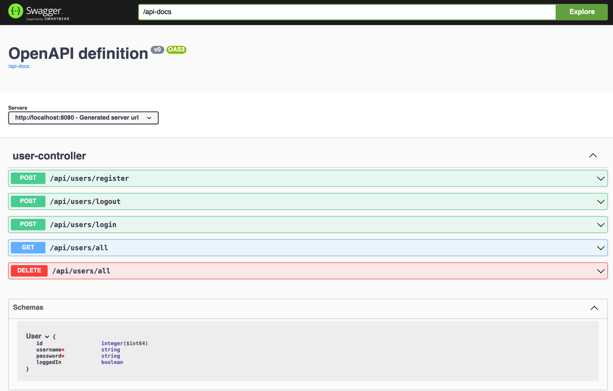

# spring-boot-users-login-sample

### Things todo list

1. Clone this repository: `git clone https://github.com/hendisantika/spring-boot-users-login-sample.git`
2. Navigate to the folder: `cd spring-boot-users-login-sample`
3. Run the application: `mvn clean spring-boot:run`
4. Open your favorite browser: http://localhost:8080/swagger-ui/index.html

### Image Scren shot

Swagger UI

